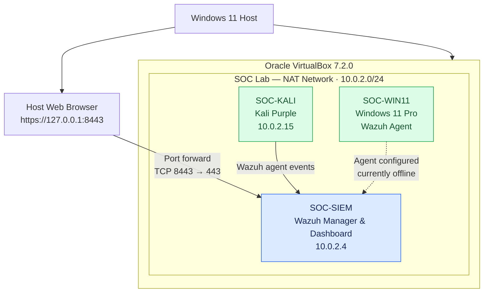

```mermaid
flowchart TB
    HOST["Windows 11 Host"]

    subgraph VB["Oracle VirtualBox 7.2.0"]
        subgraph NET["SOC Lab — NAT Network · 10.0.2.0/24"]
            SIEM["SOC-SIEM<br/>Wazuh Manager & Dashboard<br/>10.0.2.4"]
            KALI["SOC-KALI<br/>Kali Purple<br/>10.0.2.15"]
            WIN["SOC-WIN11<br/>Windows 11 Pro<br/>Wazuh Agent"]
        end
    end

    BROWSER["Host Web Browser<br/>https://127.0.0.1:8443"]

    HOST --> VB
    HOST --> BROWSER
    BROWSER -->|"Port forward<br/>TCP 8443 → 443"| SIEM
    KALI -->|"Wazuh agent events"| SIEM
    WIN -.->|"Agent configured<br/>currently offline"| SIEM

    classDef siem fill:#dbeafe,stroke:#2563eb,color:#172554
    classDef endpoint fill:#dcfce7,stroke:#16a34a,color:#14532d
    class SIEM siem
    class KALI,WIN endpoint
```
